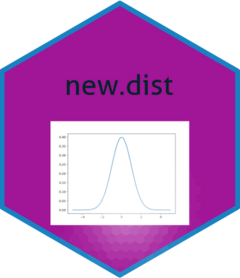

<!-- README.md is generated from README.Rmd. Please edit that file -->

# new.dist

<!-- badges: start -->

[](https://github.com/akmn35/new.dist/actions/workflows/R-CMD-check.yaml)
[](https://codecov.io/gh/akmn35/new.dist)
[](https://www.gnu.org/licenses/gpl-3.0.en.html)
[](https://github.com/akmn35/new.dist)
<!-- badges: end -->

The aim is to develop an R package,which is new.dist package, for the
probability (density) function, the distribution function, the quantile
function and the associated random number generation function for
discrete and continuous distributions, which have recently been proposed
in the literature. This package implements the following distributions:
The Power Muth Distribution, A bimodal Weibull distribution, The
discrete Lindley distribution, The gamma-Lomax distribution, weighted
geometric distribution, A power log-Dagum distribution, kumaraswamy
distribution, Lindley distribution, The unit-inverse Gaussian
distribution, EP Distribution, Akash distribution, Ishita distribution,
Maxwell distribution, The standard omega distribution, Slashed
generalized Rayleigh distribution, Two-Parameter Rayleigh Distribution,
On the Muth Distribution, Uniform-Geometric distribution, discrete
Weibull distribution.

## Installation

You can install the development version of new.dist from
\[GitHub\]\[<https://github.com/>\] with:

``` r
# install.packages("devtools")
devtools::install_github("akmn35/new.dist")
```

## Details

`new.dist` Density, distribution function, quantile function and random
generation for parameter estimation of distributions.

## Example

`dbwd` Density function for a Bimodal Weibull Distribution with
parameters shape and scale.

``` r
library(new.dist)
dbwd(1,alpha=2,beta=3,sigma=4)
#> [1] 0.01594262
```

`pbwd` distribution function for a Bimodal Weibull Distribution with
parameters shape and scale.

``` r
library(new.dist)
pbwd(1,alpha=2,beta=3,sigma=4)
#> [1] 0.003859685
```

`qbwd` quantile function for a Bimodal Weibull Distribution with
parameters shape and scale.

``` r
library(new.dist)
qbwd(.7,alpha=2,beta=3,sigma=4)
#> [1] 4.759942
```

`rbwd` random generation for a Bimodal Weibull Distribution with
parameters shape and scale.

``` r
library(new.dist)
  rbwd(5,alpha=2,beta=3,sigma=4)
#> [1] 3.120800 4.484258 1.668770 2.708343 4.207579
```

`dsgrd` Density function for a Slashed generalized Rayleigh distribution
with parameters shape, scale and kurtosis.

``` r
library(new.dist)
dsgrd(2,theta=3,alpha=1,q=4)
#> [1] 0.08314235
```

`psgrd` Distribution function for a Slashed generalized Rayleigh
distribution with parameters shape, scale and kurtosis.

``` r
library(new.dist)
psgrd(5,theta=3,alpha=1,q=4)
#> [1] 0.9989333
```

`qsgrd` quantile function for a Slashed generalized Rayleigh
distribution with parameters shape, scale and kurtosis.

``` r
library(new.dist)
qsgrd(.4,theta=3,alpha=1,q=4)
#> [1] 0.8358487
```

`rsgrd` random generation for a Slashed generalized Rayleigh
distribution with parameters shape, scale and kurtosis.

``` r
library(new.dist)
  rsgrd(5,theta=3,alpha=1,q=4)
#> [1] 1.2359185 1.6260581 1.1297133 0.5929445 0.7310307
```

`dsod` Density function for a the standard omega distribution with alpha
and beta parameters.

``` r
library(new.dist)
dsod(0.4, alpha=1, beta=2)
#> [1] 0.6986559
```

`psod` Distribution function for a the standard omega distribution with
alpha and beta parameters.

``` r
library(new.dist)
psod(0.4, alpha=1, beta=2)
#> [1] 0.1490371
```

`qsod` quantile function for a the standard omega distribution with
alpha and beta parameters.

``` r
library(new.dist)
qsod(.8, alpha=1, beta=2)
#> [1] 0.9607689
```

`rsod` random generation for a the standard omega distribution with
alpha and beta parameters.

``` r
library(new.dist)
  rsod(5, alpha=1, beta=2)
#> [1] 0.8705196 0.5414994 0.7425864 0.7768764 0.8776445
```

`dugd` Density function for the Uniform-Geometric distribution with
theta parameters.

``` r
library(new.dist)
dugd(1, theta=0.5)
#> [1] 0.6931472
```

`pugd` Distribution function for the Uniform-Geometric distribution with
theta parameters.

``` r
library(new.dist)
pugd(1,theta=.5)
#> [1] 0.6931472
```

`qugd` quantile function for the Uniform-Geometric distribution with
theta parameters.

``` r
library(new.dist)
qugd(0.6,theta=.1)
#> [1] 4
```

`rugd` random generation for the Uniform-Geometric distribution with
theta parameters.

``` r
library(new.dist)
  rugd(5,theta=.1)
#> [1] 10 14  3  6  8
```

`dtpmd` Density function for the Power Muth distribution with parameters
shape and scale.

``` r
library(new.dist)
dtpmd(1, beta=2, alpha=3)
#> [1] 0.04952547
```

`ptpmd` Distribution function for the Power Muth distribution with
parameters shape and scale.

``` r
library(new.dist)
ptpmd(1,beta=2,alpha=3)
#> [1] 0.008115344
```

`qtpmd` quantile function for the Power Muth distribution with
parameters shape and scale.

``` r
library(new.dist)
qtpmd(.5,beta=2,alpha=3)
#> [1] 1.990084
```

`rtpmd` random generation for the Power Muth distribution with
parameters shape and scale.

``` r
library(new.dist)
  rtpmd(5,beta=2,alpha=3)
#> [1] 1.607985 1.393923 2.052771 2.314339 1.331145
```

`dtprd` Density function for the Two-Parameter Rayleigh distribution
with parameters location and scale.

``` r
library(new.dist)
dtprd(5, lambda=4, mu=4)
#> [1] 0.1465251
```

`ptprd` Distribution function for Two-Parameter Rayleigh distribution
with parameters location and scale.

``` r
library(new.dist)
ptprd(2,lambda=2,mu=1)
#> [1] 0.8646647
```

`qtprd` quantile function for Two-Parameter Rayleigh distribution with
parameters location and scale.

``` r
library(new.dist)
qtprd(.5,lambda=2,mu=1)
#> [1] 0.411295
```

`rtprd` random generation for Two-Parameter Rayleigh distribution with
parameters location and scale.

``` r
library(new.dist)
  rtprd(5,lambda=2,mu=1)
#> [1] 0.5860193 0.5126196 0.2274884 0.1893127 0.1945894
```

`duigd` Density function for the unit inverse Gaussian distribution with
parameters mean and scale.

``` r
library(new.dist)
duigd(1, mu=2, lambda=3)
#> [1] 0.4749088
```

`puigd` Distribution function for the unit inverse Gaussian distribution
with parameters mean and scale.

``` r
library(new.dist)
puigd(1,mu=2,lambda=3)
#> [1] 0.2873867
```

`quigd` quantile function for the unit inverse Gaussian distribution
with parameters mean and scale.

``` r
library(new.dist)
quigd(.1,mu=2,lambda=3)
#> [1] 0.6104128
```

`ruigd` random generation for the unit inverse Gaussian distribution
with parameters mean and scale.

``` r
library(new.dist)
  ruigd(5,mu=2,lambda=3)
#> [1] 1.6763548 2.6857806 0.6843277 7.5392129 1.3427629
```

`dwgd` Density function for the Weighted Geometric distribution with
alpha and lambda parameters.

``` r
library(new.dist)
dwgd(1,alpha=.2,lambda=3)
#> [1] 0.79872
```

`pwgd` Distribution function for the Weighted Geometric distribution
with alpha and lambda parameters.

``` r
library(new.dist)
dwgd(1,alpha=.2,lambda=3)
#> [1] 0.79872
```

`qwgd` quantile function for the Weighted Geometric distribution with
alpha and lambda parameters.

``` r
library(new.dist)
qwgd(.98,alpha=.2,lambda=3)
#> [1] 3
```

`rwgd` random generation for the Weighted Geometric distribution with
alpha and lambda parameters.

``` r
library(new.dist)
  rwgd(5,alpha=.2,lambda=3)
#> [1] 1 1 1 3 1
```

`ddld` Density function for the discrete Lindley distribution with theta
parameters.

``` r
library(new.dist)
ddld(1,theta=2)
#> [1] 0.1828223
```

`pdld` Distribution function for the discrete Lindley distribution with
theta parameters.

``` r
library(new.dist)
ddld(1,theta=2)
#> [1] 0.1828223
```

`qdld` quantile function for the discrete Lindley distribution with
theta parameters.

``` r
library(new.dist)
qdld(.993,theta=2)
#> [1] 3
```

`rdld` random generation for the discrete Lindley distribution with
theta parameters.

``` r
library(new.dist)
  rdld(5,theta=1)
#> [1] 2 1 1 0 1
```

`demd` Density function for a Maxwell distribution with theta
parameters.

``` r
library(new.dist)
demd(1,theta=2)
#> [1] 0.4839414
```

`pemd` Distribution function for a Maxwell distribution with theta
parameters.

``` r
library(new.dist)
pemd(1,theta=2)
#> [1] 0.198748
```

`qemd` quantile function for a Maxwell distribution with theta
parameters.

``` r
library(new.dist)
qemd(.4,theta=5)
#> [1] 2.161694
```

`remd` random generation for a Maxwell distribution with theta
parameters.

``` r
library(new.dist)
  remd(5,theta=1)
#> [1] 0.7329693 0.8683152 2.0747229 1.2190209 1.0622745
```

`depkd` Density function for kumaraswamy distribution with parameters
shapes.

``` r
library(new.dist)
depkd(0.1,lambda=2,alpha=3)
#> [1] 0.58806
```

`pepkd` Distribution function for kumaraswamy distribution with
parameters shapes.

``` r
library(new.dist)
depkd(0.1,lambda=2,alpha=3)
#> [1] 0.58806
```

`qepkd` quantile function for kumaraswamy distribution with parameters
shapes.

``` r
library(new.dist)
pepkd(0.5,lambda=2,alpha=3)
#> [1] 0.578125
```

`repkd` random generation for kumaraswamy distribution with parameters
shapes.

``` r
library(new.dist)
  repkd(5,lambda=2,alpha=3)
#> [1] 0.3116923 0.8229843 0.9054640 0.7010439 0.2277105
```

`dgld` Density function for the gamma-Lomax Distribution with parameters
shapes and beta parameter.

``` r
library(new.dist)
dgld(1,a=2,alpha=3,beta=4)
#> [1] 0.2056491
```

`pgld` distribution function for the gamma-Lomax Distribution with
parameters shapes and beta parameter.

``` r
library(new.dist)
dgld(1,a=2,alpha=3,beta=4)
#> [1] 0.2056491
```

`qgld` quantile function for the gamma-Lomax Distribution with
parameters shapes and beta parameter.

``` r
library(new.dist)
qgld(.8,a=2,alpha=3,beta=4)
#> [1] 6.852518
```

`rgld` random generation for the gamma-Lomax Distribution with
parameters shapes and beta parameter.

``` r
library(new.dist)
  rgld(5,a=2,alpha=3,beta=4)
#> [1]  3.3305914  0.9988347  1.4214106 18.9699022  4.9608459
```

`dndd` Density function for a new discrete distribution with parameters
theta.

``` r
library(new.dist)
dndd(2,theta=2)
#> [1] 0.03530023
```

`pndd` Distribution function for a new discrete distribution with
parameters theta.

``` r
library(new.dist)
pndd(1,theta=2)
#> [1] 0.7744412
```

`qndd` quantile function for a new discrete distribution with parameters
theta.

``` r
library(new.dist)
qndd(.5,theta=2)
#> [1] 1
```

`rndd` random generation for a new discrete distribution with parameters
theta.

``` r
library(new.dist)
  rndd(5,theta=1)
#> [1] 3 3 2 2 1
```

`dnld` Density function for the New Life distribution with lambda and
beta parameters.

``` r
library(new.dist)
dnld(1, lambda=2, beta=3)
#> [1] 0.05165063
```

`pnld` Distribution function for the New Life distribution with lambda
and beta parameters.

``` r
library(new.dist)
pnld(1, lambda=2, beta=3)
#> [1] 0.9836125
```

`qnld` quantile function for the New Life distribution with lambda and
beta parameters.

``` r
library(new.dist)
qnld(.8,lambda=2,beta=3)
#> [1] 0.295895
```

`rnld` random generation for the New Life distribution with lambda and
beta parameters.

``` r
library(new.dist)
  rnld(5,lambda=2,beta=3)
#> [1] 0.04161840 0.09262510 0.14740604 0.08490178 0.13561683
```

`dnoPDD` Density function for a new one parameter discrete distribution
with scale parameters.

``` r
library(new.dist)
dnoPDD(1,theta=2)
#> [1] 0.1412194
```

`pnoPDD` Distribution function for a new one parameter discrete
distribution with scale parameters.

``` r
library(new.dist)
pnoPDD(1,theta=2)
#> [1] 0.3115553
```

`qnoPDD` quantile function for a new one parameter discrete distribution
with scale parameters.

``` r
library(new.dist)
dnoPDD(.8,theta=2)
#> [1] 0.163461
```

`rnoPDD` random generation for a new one parameter discrete distribution
with scale parameters.

``` r
library(new.dist)
  rnoPDD(5,theta=2)
#> [1] 3.052662 4.001825 3.808781 1.829154 3.947339
```

`domd` Density function for on the muth distribution with alpha
parameters.

``` r
library(new.dist)
domd(1,alpha=.2)
#> [1] 0.4123689
```

`pomd` Distribution function for on the muth distribution with alpha
parameters.

``` r
library(new.dist)
pomd(1,alpha=.2)
#> [1] 0.596272
```

`qomd` quantile function for on the muth distribution with alpha
parameters.

``` r
library(new.dist)
qomd(.8,alpha=.2)
#> [1] 1.637047
```

`romd` random generation for on the muth distribution with alpha
parameters.

``` r
library(new.dist)
  domd(5,alpha=.2)
#> [1] 0.001271151
```

`dpldd` Density function for a Power Log Dagum distribution with alpha,
beta and theta parameters.

``` r
library(new.dist)
dpldd(1, alpha=2, beta=3, theta=4)
#> [1] 0.1766842
```

`ppldd` Distribution function for a Power Log Dagum distribution with
alpha, beta and theta parameters.

``` r
library(new.dist)
ppldd(1, alpha=2, beta=3, theta=4)
#> [1] 0.9742603
```

`qpldd` quantile function for a Power Log Dagum distribution with alpha,
beta and theta parameters.

``` r
library(new.dist)
qpldd(.8, alpha=2, beta=3, theta=4)
#> [1] 0.6109249
```

`rpldd` random generation for a Power Log Dagum distribution with alpha,
beta and theta parameters.

``` r
library(new.dist)
  rpldd(5, alpha=2, beta=3, theta=4)
#> [1]  0.7944854  0.1669816 -0.0633556  0.6087078 -0.6091177
```

`drld` Density function for a lindley distribution with parameters
theta.

``` r
library(new.dist)
drld(1,theta=2)
#> [1] 0.3608941
```

`prld` Distribution function for a lindley distribution with parameters
theta.

``` r
library(new.dist)
prld(1,theta=2)
#> [1] 0.7744412
```

`qrld` quantile function for a lindley distribution with parameters
theta.

``` r
library(new.dist)
qrld(.5,theta=2)
#> [1] 0.4872058
```

`rrld` random generation for a lindley distribution with parameters
theta.

``` r
library(new.dist)
  rrld(5,theta=1)
#> [1] 1.5803062 2.8959937 1.2205912 0.5895682 0.5271694
```

## Corresponding Author

Department of Statistics, Faculty of Science, Selcuk University, 42250,
Konya, Turkey <br /> Email:<coskun@selcuk.edu.tr>

## References

Vila, R. ve Niyazi Çankaya, M., 2022, *A bimodal Weibull distribution:
properties and inference*,Journal of Applied Statistics, 49 (12),
3044-3062.

Iriarte, Y. A., Vilca, F., Varela, H. ve Gómez, H. W., 2017, *Slashed
generalized Rayleigh distribution*, Communications in Statistics-Theory
and Methods, 46 (10), 4686-4699.

Birbiçer, İ. ve Genç, A. İ., 2022, *On parameter estimation of the
standard omega distribution*. Journal of Applied Statistics, 1-17.

Akdoğan, Y., Kuş, C., Asgharzadeh, A., Kınacı, İ., & Sharafi, F. (2016).
*Uniform-geometric distribution*. Journal of Statistical Computation and
Simulation, 86(9), 1754-1770.

Jodra, P., Gomez, H. W., Jimenez-Gamero, M. D., & Alba-Fernandez, M. V.
(2017). *The power Muth distribution* . Mathematical Modelling and
Analysis, 22(2), 186-201.

Dey, S., Dey, T. ve Kundu, D., 2014, *Two-parameter Rayleigh
distribution: different methods of estimation*, American Journal of
Mathematical and Management Sciences, 33 (1), 55-74.

Ghitany, M., Mazucheli, J., Menezes, A. ve Alqallaf, F., 2019, *The
unit-inverse Gaussian distribution: A new alternative to two-parameter
distributions on the unit interval*, Communications in Statistics-Theory
and Methods, 48 (14), 3423-3438.

Najarzadegan, H., Alamatsaz, M. H., Kazemi, I. ve Kundu, D., 2020,
*Weighted bivariate geometric distribution: Simulation and estimation*,
Communications in Statistics-Simulation and Computation, 49 (9),
2419-2443.

Gómez-Déniz, E. ve Calderín-Ojeda, E., 2011, *The discrete Lindley
distribution: properties and applications*.Journal of statistical
computation and simulation, 81 (11), 1405-1416.

Krishna, H., Vivekanand ve Kumar, K., 2015, *Estimation in Maxwell
distribution with randomly censored data*, Journal of statistical
computation and simulation, 85 (17), 3560-3578.

Kohansal, A. ve Bakouch, H. S., 2021, *Estimation procedures for
Kumaraswamy distribution parameters under adaptive type-II hybrid
progressive censoring*, Communications in Statistics-Simulation and
Computation, 50 (12), 4059-4078.

Cordeiro, G. M., Ortega, E. M. ve Popović, B. V., 2015, *The gamma-Lomax
distribution*, Journal of statistical computation and simulation, 85
(2), 305-319.

Bakouch, H. S., Jazi, M. A. ve Nadarajah, S., 2014, *A new discrete
distribution, Statistics*, 48 (1), 200-240.

Kuş, C., 2007, *A new lifetime distribution*, Computational Statistics &
Data Analysis, 51 (9), 4497-4509.

Shukla, K. K., Shanker, R. ve Tiwari, M. K., 2022, *A new one parameter
discrete distribution and its applications*, Journal of Statistics and
Management Systems, 25 (1), 269-283.

Jodrá, P., Jiménez-Gamero, M. D. ve Alba-Fernández, M. V., 2015, *On the
Muth distribution, Mathematical Modelling and Analysis*, 20 (3),
291-310.

Bakouch, H. S., Khan, M. N., Hussain, T. ve Chesneau, C., 2019, *A power
log-Dagum distribution: estimation and applications*, Journal of Applied
Statistics, 46 (5), 874-892.

Akgül, F. G., Acıtaş, Ş. ve Şenoğlu, B., 2018, *Inferences on
stress–strength reliability based on ranked set sampling data in case of
Lindley distribution*, Journal of statistical computation and
simulation, 88 (15), 3018-3032.

Ristić, M. M., & Balakrishnan, N. (2012), *The gamma-exponentiated
exponential distribution. Journal of statistical computation and
simulation*, 82(8), 1191-1206.
